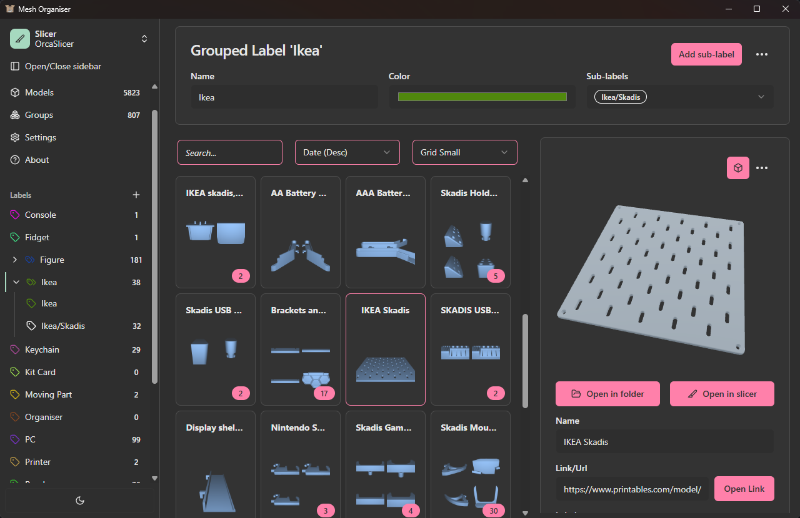

# Mesh Organiser

Competes with your downloads folder for storing 3d models.

## Install

Download the latest desktop edition from the [Releases](https://github.com/tanguille/mesh-organiser/releases/latest) page:

- **Windows** — .msi
- **macOS** — .dmg (aarch64/Arm and x64/Intel)
- **Linux** — .deb (Debian/Ubuntu), .rpm (Fedora/RHEL). Note: only slicers installed via Flatpak are supported.

## Install (Server)

Mesh Organiser is also available to be hosted as a website by making use of a server running Docker. See the [Web folder](./web/README.md) for server installation instructions.

## Site integrations

Note: To open 'Open in ...' links from these websites, you need to enable them in settings. By default they are disabled to not overwrite any integrations you may currently have.

### [Thingiverse](https://www.thingiverse.com/)

- Redirect 'Open in Cura' to app (see settings)
- Import .zip (models only)
  - Will automatically make group with .zip name

### [Printables](https://www.printables.com)

- Redirect 'Open in PrusaSlicer' (and other slicers) to app (see settings)
  - When using redirect from Printables, the link field is automatically filled
- Import .zip (models only)
  - Will automatically make group with .zip name

### [Makerworld](https://makerworld.com)

- Redirect 'Open in Bambu Studio' to app (see settings)
- Ability to extract both model and thumbnail image (see settings)

## Structure breakdown

The app knows 4 layers of organisation:

- Model: A singular 3d model of any kind
- Group: A collection of 3d models with a strong relationship (like multiple parts of a bigger model)
  - Groups their contents are not intended to be edited after creation. Use Labels for this goal.
- Label: A collection of 3d models with a weak relationship (like multiple models/groups of the same type; like 'wall art' or 'puzzle')
  - Labels thier contents can be edited at any time using the label dropdown menu on groups, models or a collection of models.
- Project: A collection of groups needed to complete a project. Also offers a folder to store instructions (.pdf), or other misc files.

## Additional features

- Compresses imported models to save disk space
- Hold Shift/Control to select multiple models or groups at once
- Import .step files (thumbnail generation does not work yet for .step files) (see settings, disabled by default)
- Import .gcode files
- Open slicer after importing from website (see settings, disabled by default)
- Supported slicers: PrusaSlicer, OrcaSlicer, Cura, Bambu Studio
  - Request more via the [Issues tab](https://github.com/tanguille/mesh-organiser/issues)
- Deduplicates imported models using a hash
  - Importing the same model twice will not duplicate it; it'll be registered as the same model

## Credits

Originally developed by Sims. Forked by [Tanguille](https://github.com/tanguille)

- With development help from [dorkeline](https://github.com/dorkeline) and Ajadaz
- With testing help from atomique13, ioan18 and einso

Links:

- [Thumbnail Generator](https://github.com/tanguille/mesh-thumbnail)
- [Report an issue / Request a feature](https://github.com/tanguille/mesh-organiser/issues)
