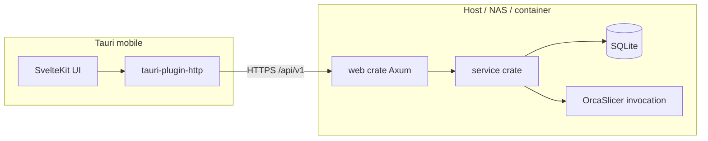

# Remote client and HTTP API — consolidated design spec

**Status:** Approved for implementation planning  
**Date:** 2026-03-29  
**Relates to:** [2026-03-29-mobile-app-design.md](./2026-03-29-mobile-app-design.md), [2026-03-29-tauri-mobile-app.md](./2026-03-29-tauri-mobile-app.md)

This document **consolidates decisions** from brainstorming (2026-03-29). Where it conflicts with the two older specs, **this file wins**. The older files remain as background; update or annotate them only if you want a single historical narrative.

---

## 1. Purpose and scope

### 1.1 Goal

Deliver a **coherent end-to-end** capability:

- **Tauri mobile** (Android first; iOS when cost is low) runs the **same SvelteKit UI** as desktop where practical, but operates as a **thin client** to a **remote** Mesh Organiser instance.
- The **HTTP API** is implemented by the existing **`web`** crate (**Axum**), extending `/api/v1/...` as needed. **No Actix.** No revival of removed orphan Tauri `web_server` patterns.
- **Desktop Tauri** keeps **local SQLite + IPC** behaviour unless/until a separate decision adds an optional embedded HTTP server (see §5).

### 1.2 Non-goals (explicit)

- **Printer control as a first-class Mesh Organiser API** (job queue, firmware protocols, driver management). **OrcaSlicer** is responsible for talking to printers after slicing; Mesh Organiser does **not** implement a parallel printer stack.
- **Offline-first mobile** (no sync queue requirement for v1); remote server must be reachable for core flows.
- **React Native** or a separate mobile codebase.

### 1.3 Success criteria (v1)

- Mobile can **configure base URL** (with env defaults), **authenticate** consistently with web, **list and open models** (including thumbnails), and **request slicing** with **basic settings**, receiving artifacts/previews the server provides.
- **`web`** exposes the **minimal HTTP surface** required for those flows under **`/api/v1/`**, reusing **`service`** / **`db`** patterns used elsewhere in `web` controllers.
- **No full HTTP server** runs **inside** Android/iOS Tauri builds.
- **Configuration** is discoverable via **documented environment variables** (§6).

---

## 2. Architecture

- **Client:** Tauri mobile uses **`tauri-plugin-http`** for cross-origin requests to the configured base URL (cookies/headers per existing web auth model).
- **Server:** Single **`web`** binary; **Axum** router already merges controllers — new routes follow the same style (`login_required` where appropriate).
- **Slicing:** Server-side flow invokes **OrcaSlicer** (or existing service abstractions) consistent with desktop semantics; **printing** after that is **Orca’s** concern, not new Mesh Organiser REST resources.

---

## 3. API contract principles

- **Prefix:** All JSON API routes stay under **`/api/v1/`** (existing pattern). Do not introduce a parallel `/api/` tree without migration plan.
- **Auth:** Same session/cookie (or token) behaviour as current **`web`** auth (`auth_controller`, `users/me`, etc.). Mobile client must send credentials the server expects; exact header/cookie strategy must match implementation (document in implementation plan).
- **New endpoints (illustrative — names/payloads finalized in implementation plan):**
  - **Models / blobs / thumbnails:** largely **already present**; mobile client binds to existing shapes where possible.
  - **Slicing:** e.g. `POST /api/v1/slicer/slice` (or nested under models) with **basic settings** (layer height, infill, supports, material) — **exact schema** defined when mapping to `service` capabilities.
- **Deprecated relative to older mobile specs:** First-class **`/api/printers`**, **`POST .../print`**, **print job status** resources are **out of scope** unless a future spec reintroduces them for a concrete integration.

---

## 4. Frontend / Tauri client

### 4.1 API initialization

- **`initApi()`** gains a branch: when **`isTauri()`** and **mobile** (use existing **`is_mobile`** invoke or equivalent), use a **remote HTTP API** implementation (new initializer, e.g. `initTauriRemoteApis`) instead of **`initTauriLocalApis`**.
- **Desktop Tauri** unchanged: continues **`initTauriLocalApis`**.

### 4.2 Server URL

- **Tauri commands** (or plugin storage): **`get_server_url`**, **`set_server_url`** (and optionally **`clear_server_url`**), persisting the configured **base URL** (scheme + host + optional port, no trailing slash policy documented in plan).
- **First-run / settings UI:** screen to enter URL, **test connection**, save (per [2026-03-29-tauri-mobile-app.md](./2026-03-29-tauri-mobile-app.md) intent).

### 4.3 Environment variables (build-time defaults)

| Variable                     | Used by       | Purpose                                                                                              |
| ---------------------------- | ------------- | ---------------------------------------------------------------------------------------------------- |
| **`VITE_MOBILE_SERVER_URL`** | Vite / Svelte | Default **remote base URL** pre-filled for mobile builds (e.g. dev NAS). Document in `.env.example`. |
| **`VITE_API_PLATFORM`**      | Existing      | Unchanged (`demo`, `web`, default Tauri).                                                            |

Runtime URL **always** wins over empty default once user saves settings.

### 4.4 Rust mobile backend

- **`get_platform` / `is_mobile`:** already present — keep.
- **Longer term (implementation plan):** gate **`db`** / local-only commands on **non-mobile** so Android/iOS do not require local model DB for normal operation; exact `cfg` and feature split is **implementation detail** in the plan.
- **Capabilities:** keep **`mobile.json`** HTTP allowlist; tighten **`connect-src` / CSP** for production mobile builds in the plan where needed.

---

## 5. Where the HTTP server runs (platform matrix)

| Platform                          | Full Axum **`web`** server                                                                                                                                                                                                                                                                                      |
| --------------------------------- | --------------------------------------------------------------------------------------------------------------------------------------------------------------------------------------------------------------------------------------------------------------------------------------------------------------- |
| **Android / iOS (Tauri)**         | **Must not** run the **`web`** server inside the app.                                                                                                                                                                                                                                                           |
| **Desktop Tauri**                 | **Does not** embed the Axum app today. **Do not** auto-start a full HTTP API inside Tauri without a **follow-up spec**. If ever added: **default off**, **enabled only** via **app settings** persisted in configuration, with optional **env override** for dev/CI (e.g. `MESH_ORGANISER_ENABLE_LOCAL_API=1`). |
| **NAS / container / dev machine** | Operator **explicitly** runs the **`web`** binary (Docker, systemd, manual). That is the **supported** way to expose `/api/v1`.                                                                                                                                                                                 |

**Clarification:** “Disabled unless explicitly enabled in settings” applies to **any future embedded/local API inside Tauri**, not to stopping someone from running the standalone **`web`** process (that remains an explicit ops choice).

---

## 6. Server / ops environment variables

Document alongside **`docs/commands.md`** (or equivalent) when implementing:

| Variable                        | Component      | Purpose                                                                                                                                   |
| ------------------------------- | -------------- | ----------------------------------------------------------------------------------------------------------------------------------------- |
| **`SERVER_PORT`**               | `web`          | Listen port (existing; default `3000`).                                                                                                   |
| **`APP_CONFIG_PATH`**           | `web`          | Path to JSON config (existing).                                                                                                           |
| **`RUST_LOG`**                  | `web`          | Logging (existing).                                                                                                                       |
| Optional **`MESH_ORGANISER_*`** | `web` / future | Only if implementation adds **bind address**, **API enabled gate**, or **CORS** overrides — names to be fixed in the implementation plan. |

---

## 7. Phased delivery (for writing-plans)

Order is **contract-first**, then **server**, then **client**, then **hardening**.

1. **API contract note** in repo (OpenAPI optional): list endpoints, auth, and TypeScript/Rust DTO alignment for mobile slice + model read paths.
2. **`web`:** implement missing **slicing** (and any **thin** model/blob helpers) under `/api/v1/`, delegating to **`service`**.
3. **Tauri:** **`get_server_url` / `set_server_url`**, secure persistence, **`initApi`** mobile branch + HTTP client layer mirroring **`initWebApi`** patterns.
4. **UI:** server setup flow; replace placeholder **slice** / **print** tabs: **slice** = real settings + server call; **print** tab = **remove or repurpose** (e.g. “open in Orca” / history of sliced outputs) — **no** fake printer queue unless spec changes.
5. **Quality:** tests (Vitest for client glue; Rust tests for handlers where feasible), CSP/connect rules, error UX.

---

## 8. Security

- Prefer **HTTPS** for remote base URL in production; document LAN HTTP exception if used.
- Validate **server URL** input (scheme, no obvious SSRF footguns in server-side fetches if any).
- **Tokens / cookies:** store per Tauri secure storage guidance in implementation plan.

---

## 9. Testing strategy

- **Server:** integration tests against `web` with test DB or fixtures for new routes.
- **Client:** unit tests for URL normalization, API client error handling, `initApi` branch selection.
- **E2E:** optional later; not required to close v1 spec.

---

## 10. Checklist before implementation

- [ ] Implementation plan (`writing-plans`) references this file.
- [ ] Old specs updated with a one-line pointer to this doc **or** left as historical only (team choice).
- [ ] No printer REST scope in v1 unless explicitly re-scoped.

---

_End of spec — proceed to **writing-plans** for task breakdown and file-level changes._
